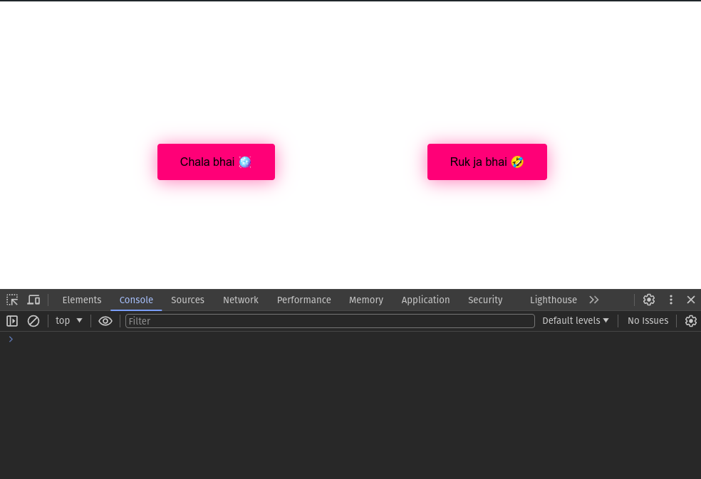
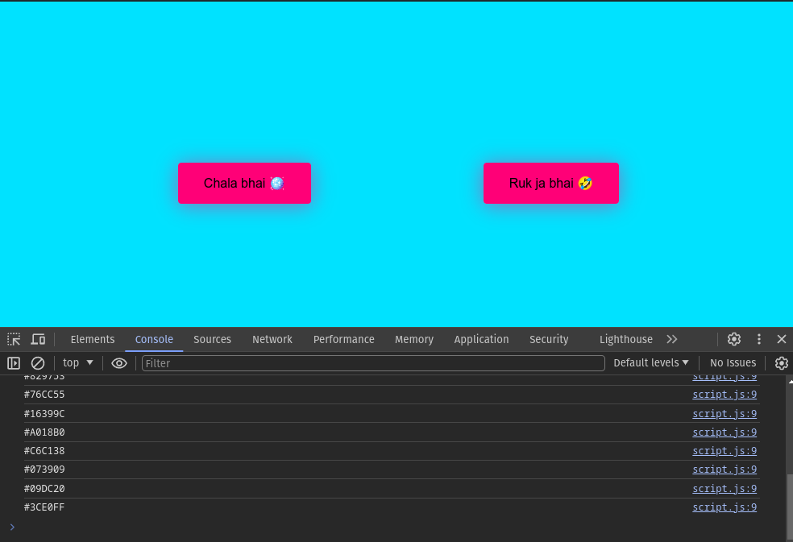
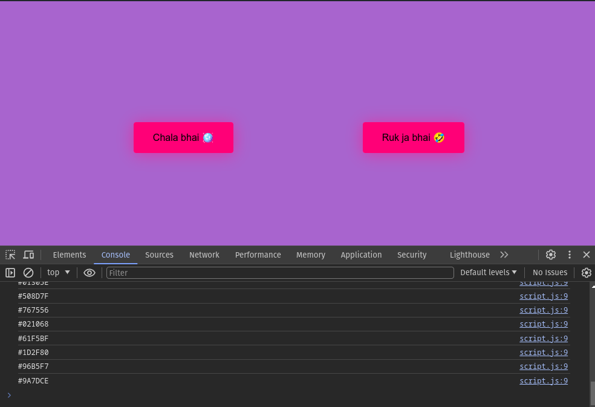
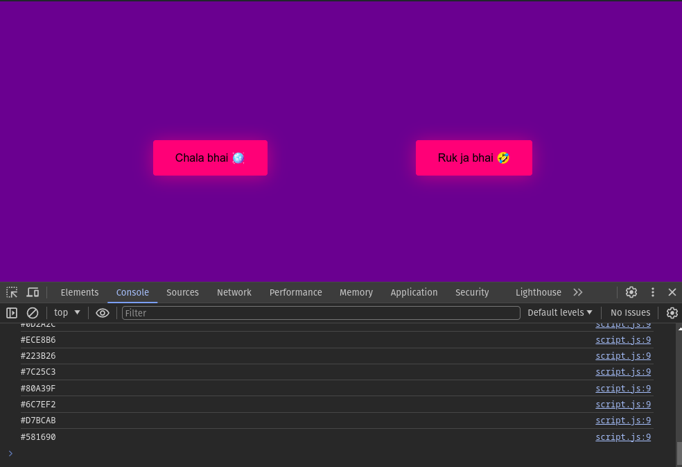
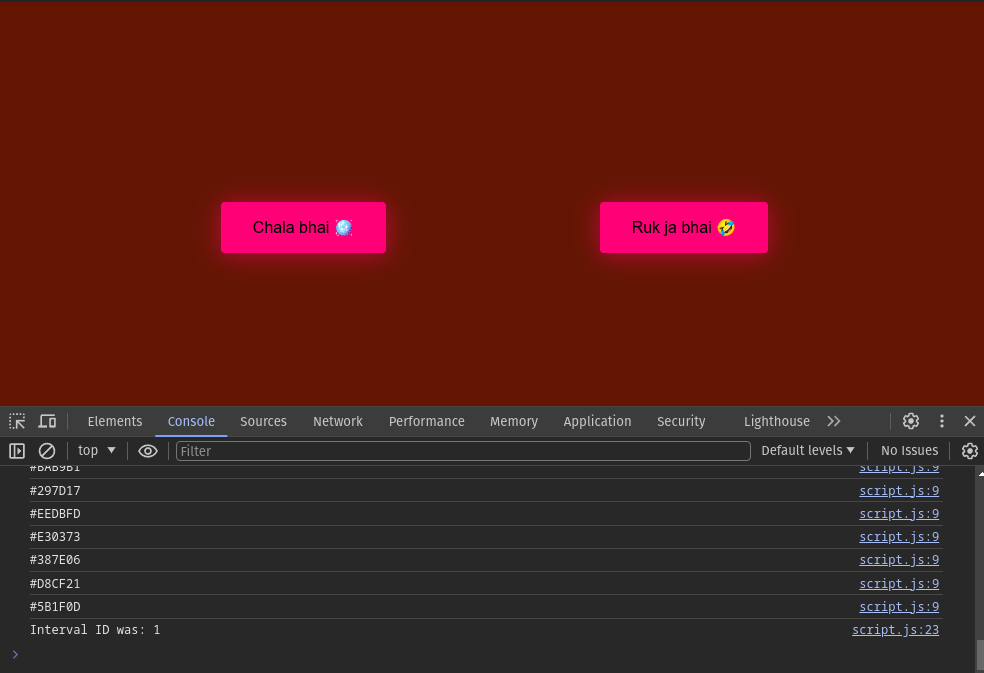
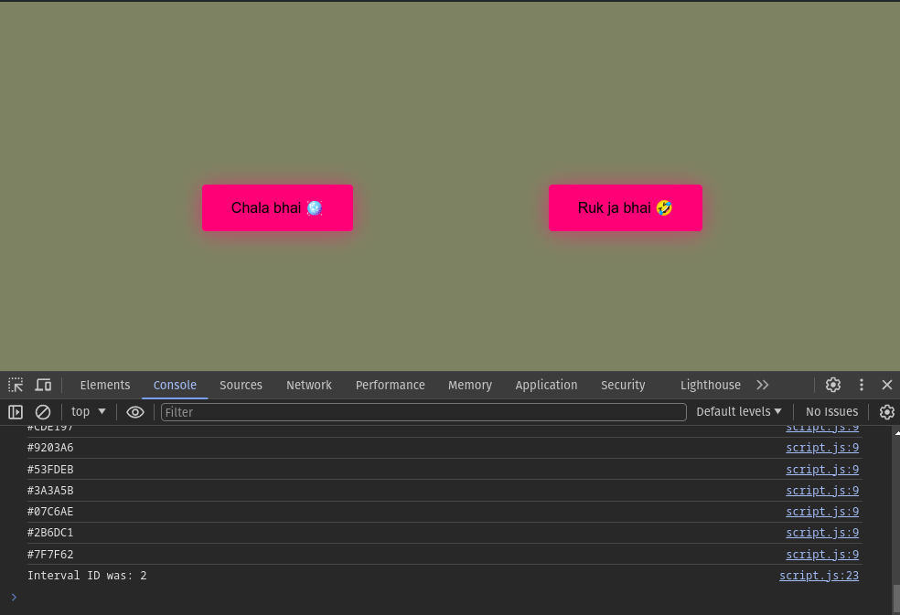

<h1>Disco Light Project</h1>

  
This repository contains a disco light functionality implemented using HTML, CSS, and JavaScript. When the user clicks on the "Chala bhai 🪩" button, the website background color changes randomly like disco lights. Clicking on the "Ruk ja bhai 🤣" button stops the color change.

  <h2>Project Overview</h2>

  
The JavaScript code listens for click events on the buttons and manipulates the DOM to change the background color randomly when the "Chala bhai 🪩" button is clicked. Clicking on the "Ruk ja bhai 🤣" button stops the color change.

  <h2>Screenshots</h2>
  
  
  
  
  
  

  <h2>Usage</h2>

  
Clone the repository to your local machine:

  <pre><code>git clone &lt;https://github.com/Dark-Programer/party-light-project.git&gt;</code></pre>

  
Open the <code>index.html</code> file in your web browser to view the disco light functionality.

